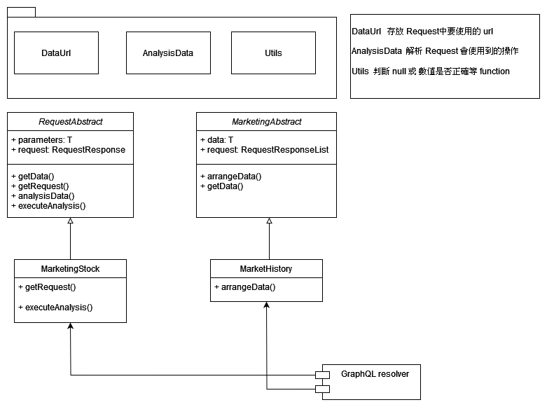

### stock-backend

```

stock-backend 架構

目的: 匯集各式各樣股票的資料
例如: 歷史交易資料 每日三大法人買賣超 等

每種類型的資料的取得都繼承 RequestAbstract 
並實作 
getRequest 取得資料
executeAnalysis 初步整理資料

相同類型的資料
繼承相關的 abstract 
由於一份資料可能由多重資料組成
所以使用 List 資料

並實作
arrangeData 將資料整理出來


最後在 GraphQL 的 resolver 將上述的兩種動作組合起來運作

```

